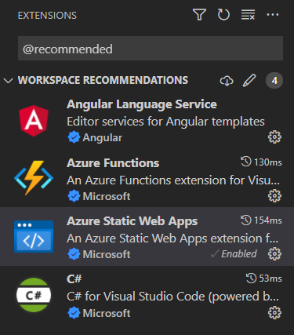

## Run Locally using Visual Studio Code

### Prerequisites

This workspace contains everything needed to launch and debug the application.

- If prompted, install the recommanded workspace extensions.



- Make sure to install all `npm` prerequisites with the following command:

```sh
cd src/angular/
npm install
npx browserslist --update-db
```

- Download the [Azure Static Web Apps](https://docs.microsoft.com/azure/static-web-apps/overview) [CLI tool](https://azure.github.io/static-web-apps-cli/docs/cli/swa/).

### Run

- Hit <kbd>F5</kbd> and wait for Chrome to display the `http://localhost:4280` login page.

- Login as `Alice`.

> **Alice**:
> - UserID: `a1118e83-92e6-4465-91e1-7595d060195c`
> - Username: `alice@example.com`
> - User’s role: `anonymous` | `authenticated` | `registered`
> - Users’ claims: `[]` (string representation of an empty JSON array)
