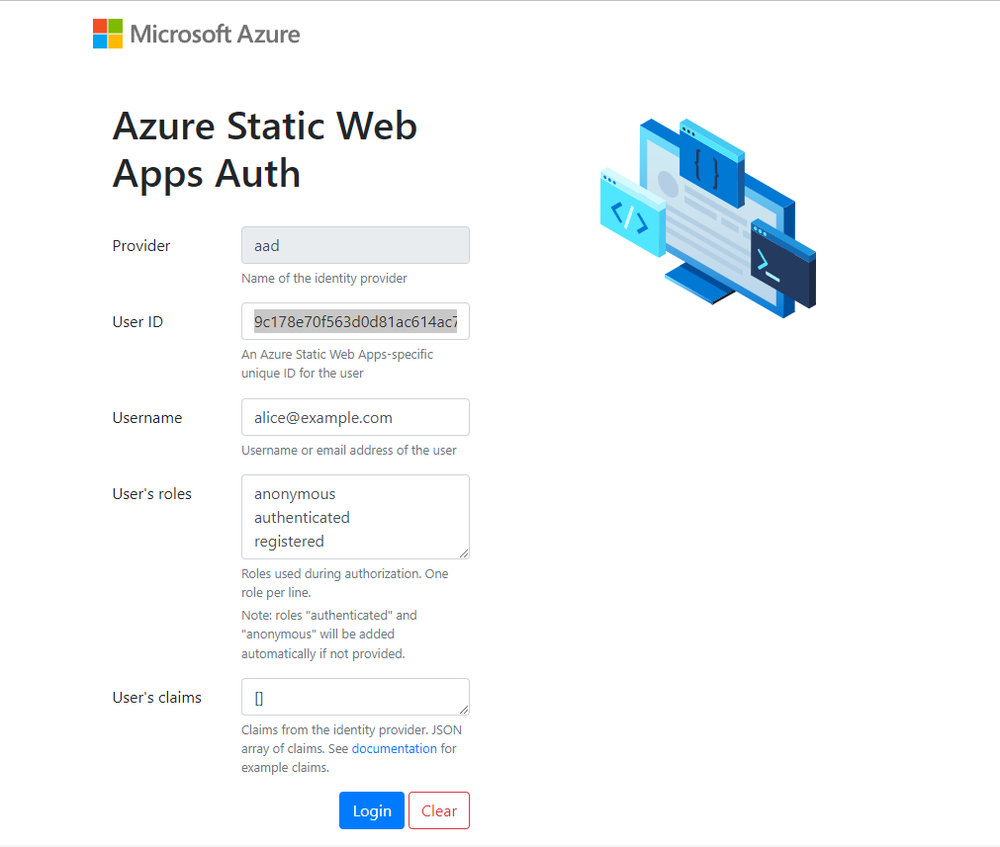
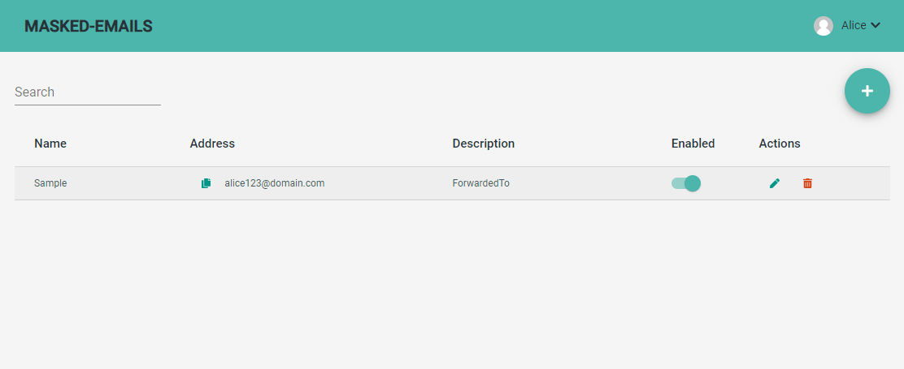

# Masked Emails Static Web App

This is an
[Azure Static Web App](https://docs.microsoft.com/azure/static-web-apps/overview)
project built with [Angular](https://angular.io/).

## Getting Started

- Open a terminal and move to the [src](./src) folder.

```
cd ./src/

```

- Compile the [backend api](../api) function app.

```
cd ./api/
dotnet restore
dotnet build --no-restore
cd ..

```

- Open a second terminal and run the [Azurite Local Storage Emulator]().

```
azurite

```

- Run the [CosmosDb Emulator](https://docs.microsoft.com/en-us/azure/cosmos-db/local-emulator).
- Initialize and [seed](../seed) the sample [CosmosDb Emulator](https://docs.microsoft.com/en-us/azure/cosmos-db/local-emulator) database.

```
cd ./api/
dotnet user-secrets set "TableStorage:ConnectionString" "UseDevelopmentStorage=true;"
dotnet user-secrets set "AppSettings:DomainName" "domain.com"
dotnet user-secrets set "CosmosDb:EndpointUri" "https://localhost:8081"
dotnet user-secrets set "CosmosDb:PrimaryKey" "C2y6yDjf5/R+ob0N8A7Cgv30VRDJIWEHLM+4QDU5DE2nQ9nDuVTqobD4b8mGGyPMbIZnqyMsEcaGQy67XIw/Jw=="
dotnet user-secrets set "CosmosDb:IgnoreSslServerCertificateValidation" "true"
cd ../seed/
dotnet run -- /seed
cd ..

```

**Note**: the preceding command lists the minimum set of parameters to specify when
running against a local storage emulator and local CosmosDb emulator. To setup test
conditions for running the [Inbox API](https://github.com/springcomp/masked-emails-inboxapi#configuration) locally, refer to the documentation.
  
- Compile, build and serve the [Angular](https://angular.io/) application.

```
cd ./angular/
npm install
ng build
ng serve
cd ..

```

- Download the [Azure Static Web Apps](https://docs.microsoft.com/azure/static-web-apps/overview) CLI tool.
- Open _a third_ terminal and serve the Static Web App.

```
cd ./angular/
swa start http://localhost:4200 --api-location ../api/

```

- Open a browser and navigate to `http://localhost:4280/` and login as `Alice` or `Bob`.

**Alice**:
- UserID: `a1118e83-92e6-4465-91e1-7595d060195c`
- Username: `alice@example.com`
- User’s role: `anonymous` | `authenticated` | `registered`
- Users’ claims: `[]` (string representation of an empty JSON array)

**Bob**:
- UserID: `fe8ee8d2-5d47-463f-8ad3-bd65fc559246`
- Username: `bobsmith@email.com`



- Enjoy!

